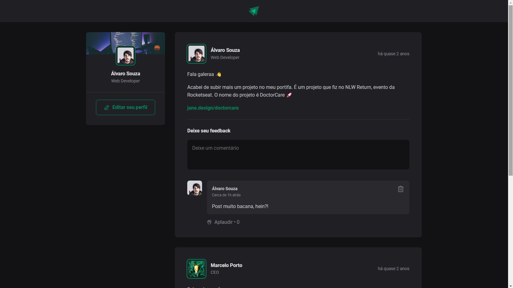

# React Post Feed

#### -> [Vercel live Demo](https://ignite-feed-demo.vercel.app/) <-


Repository made for learning purposes

## Setting up develop environment

```
pnpm install
```

Run server on <b>port 5173</b> by default, or next port available

```
pnpm run dev
```

Open your browser on designed port and boom:

## Project running



Currently, two official plugins are available:

- [@vitejs/plugin-react](https://github.com/vitejs/vite-plugin-react/blob/main/packages/plugin-react/README.md) uses [Babel](https://babeljs.io/) for Fast Refresh
- [@vitejs/plugin-react-swc](https://github.com/vitejs/vite-plugin-react-swc) uses [SWC](https://swc.rs/) for Fast Refresh

This template provides a minimal setup to get React working in Vite with HMR and some ESLint rules.

All rights reserved to [Rocketseat](https://www.rocketseat.com.br/)
